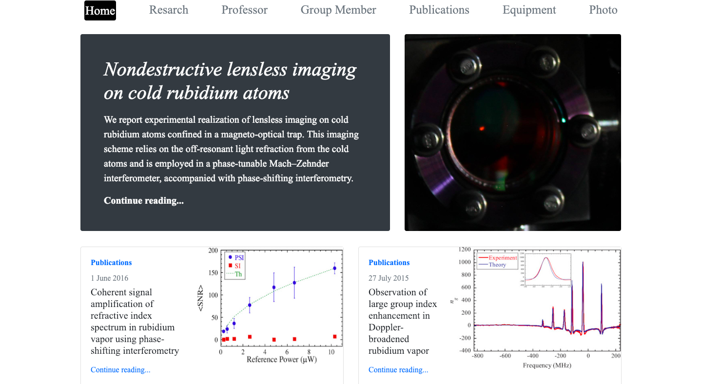
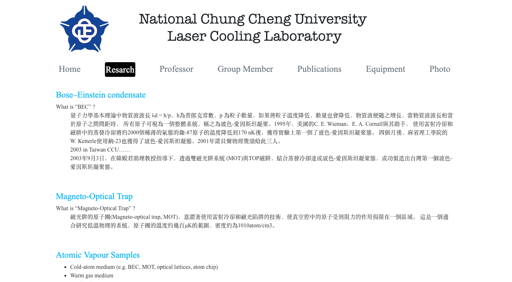
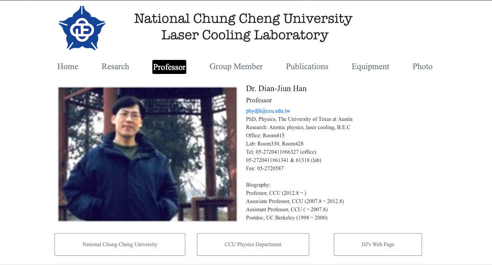
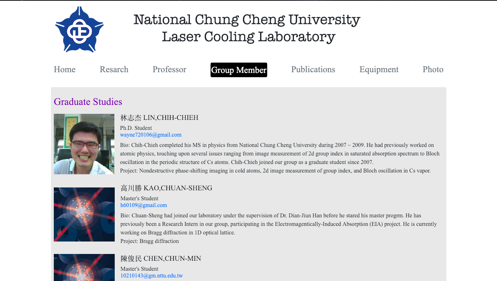
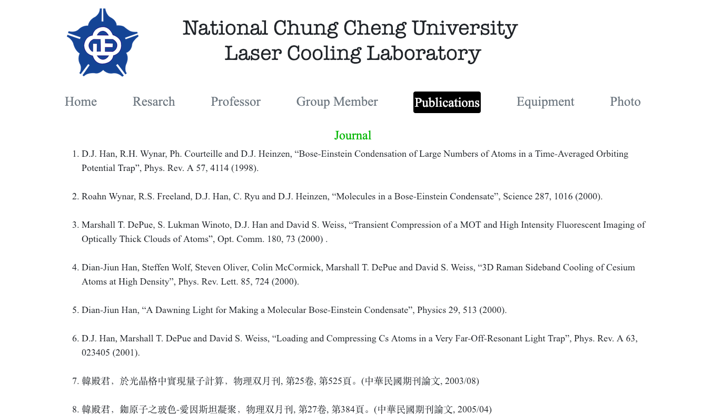
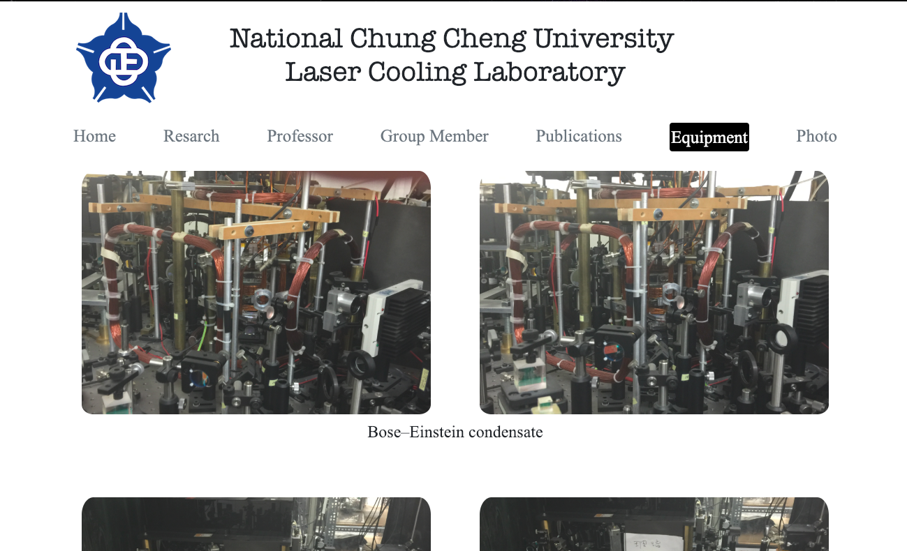
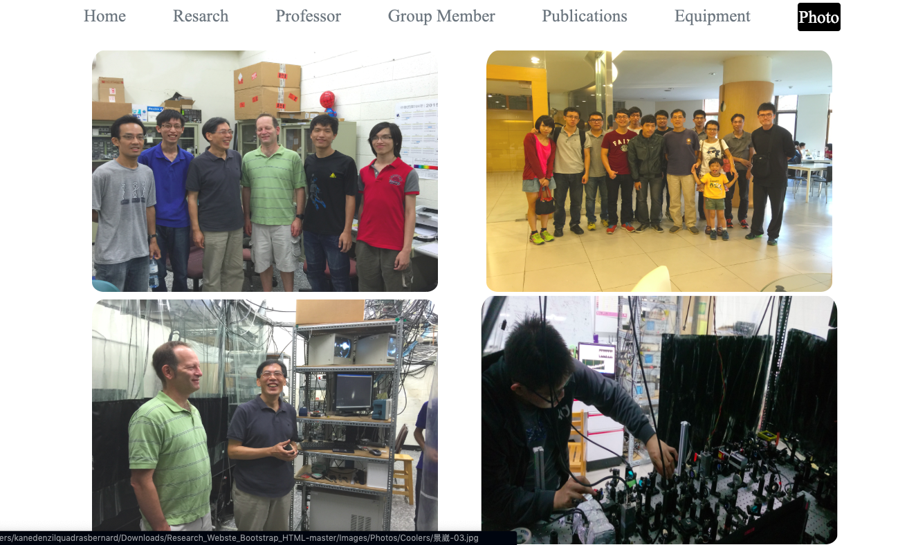

# Research_Webste_Bootstrap_HTML

A User friendly boot strap website made for National Chung Cheng University for the department of physics.This website helps us to view all the information about the project and also helps the user to know which professor is leading respective project for the university.

<b> Technologies used :</b> HTML,CSS,Bootstrap,JavaScript

## Home Page

## Research Page

## Bio Page

## Group Member Page

## Journal Publication Page

## Equipment Page

## Photo Gallery Page

